## 紀錄 習慣

- React Native v(Expo Cli -> React Native Cli)
- Spring boot  v
- MongoDB noSql  v
- Docker → DB + Redis+ Nginx(load balancer) v
- 上雲
- 上架google store

---

## 功能

```html
npx create-expo-app healthPlan

cd healthPlan
npx expo start
```

Expo

```html
npm install --global eas-cli && \
npx create-expo-app healtplan && \
cd healtplan && \
eas init --id a8c0170d-1840-4eec-8e7e-6159204c4011
```

install

```html
 npm install @react-navigation/native
npm install @react-navigation/stack
npm install -- save @react-navigation/bottom-tabs
npm install @expo/vector-icons
npm install react-native-pie-chart --save // 圖餅表
npm install react-native-svg
npx expo install react-native@0.71.14
npm install react-native-heatmap-chart --force
npm install react-native-elements
react-native-web@~0.18.10, @expo/webpack-config@^18.0.1
npm install react-native-tab-view
npm install react-native-pager-view
npm i react-native-calendars@1.1286.0
npm install @react-navigation/stack
npm i react-native-calendars@1.1286
npm install react-native-paper
npm install i18next react-i18next
npm install i18next-browser-languagedetector
npm install i18next i18next-react-native-language-detector react-native-locale-detector --save
npm install intl-pluralrules
npm install i18next-http-backend
npm install axios
```

update

```java
npm update
npm cache clean --force
npm install expo@49 --force // 更新sdk版本
```

## ESLint

[How to set up ESLint in VS Code for React Native applications that use TypeScript](https://medium.com/@josiahmahachi/how-to-set-up-eslint-in-vs-code-for-react-native-applications-that-use-typescript-7a103f264d6d)

## Ajax

[JavaScript Promise 全介紹](https://www.casper.tw/development/2020/02/16/all-new-promise/)

## Api串接

[](https://ithelp.ithome.com.tw/articles/10253259)

[Axios (in React-native) not calling server in localhost](https://stackoverflow.com/questions/42189301/axios-in-react-native-not-calling-server-in-localhost)

## Docker

[用 Docker 玩 Mongo - HackMD](https://hackmd.io/@SuFrank/BJOe3Fi3c)

[GitHub - twtrubiks/docker-tutorial: Docker 基本教學 - 從無到有 Docker-Beginners-Guide   教你用 Docker 建立 Django + PostgreSQL 📝](https://github.com/twtrubiks/docker-tutorial?tab=readme-ov-file)

```java
docker pull mongo
docker run --name MONGO_DB -v D:\mongoDB:/data/db -d -p 27017:27017 --rm mongo
mongodb://localhost:27017/
```

## Redis

[How to use Redis with Spring boot to store sessions and why 🍀](https://www.youtube.com/watch?v=4K5N7SRcyK8&ab_channel=Hamza)

## **Convert React Expo Project into React Native Project**

[How to Convert React Expo Project into React Native Project -4 | Dr Vipin Classes](https://www.youtube.com/watch?v=HQlE2aWLEAg&t=109s&ab_channel=DrVipinClasses)

```java
npx expo prebuild
npx react-native run-android
```

[No metro config found](https://www.reddit.com/r/reactjs/comments/15a6aar/no_metro_config_found/)

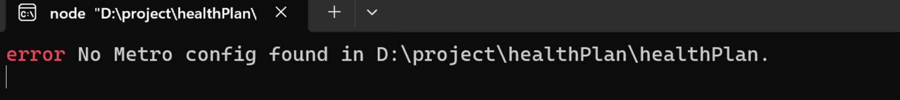  

```java
npx expo customize metro.config.js
```

```java
adb devices // 確認是否透過usb連線裝置
npm install react-native-unimodules// 套件允許您在 React Native 專案中使用各種 Expo SDKs 功能，而不需要將專案完全轉移到 Expo 中。
```
<div style="display:flex; flex-wrap: wrap;">
    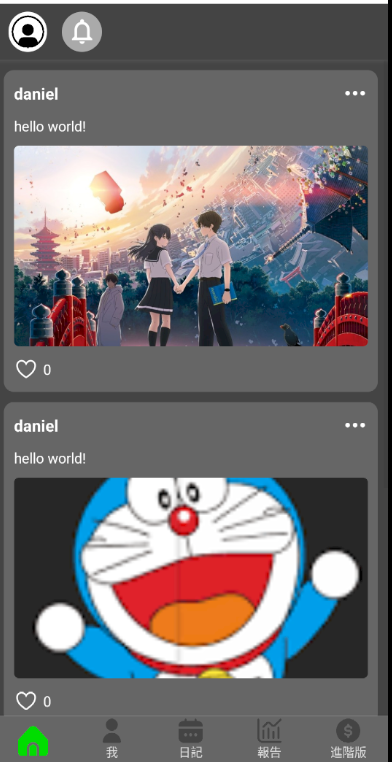
    
    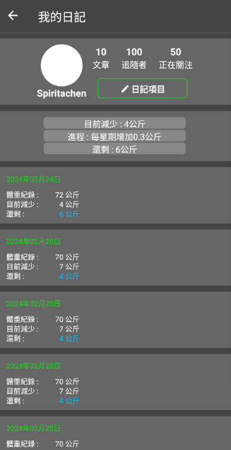
    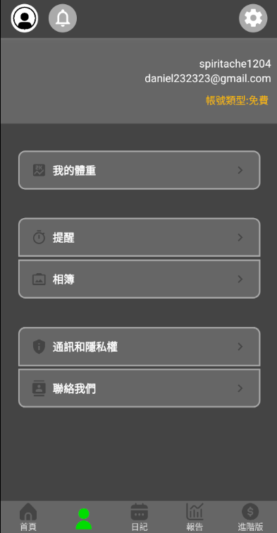
</div>
<div style="display:flex; flex-wrap: wrap;">
    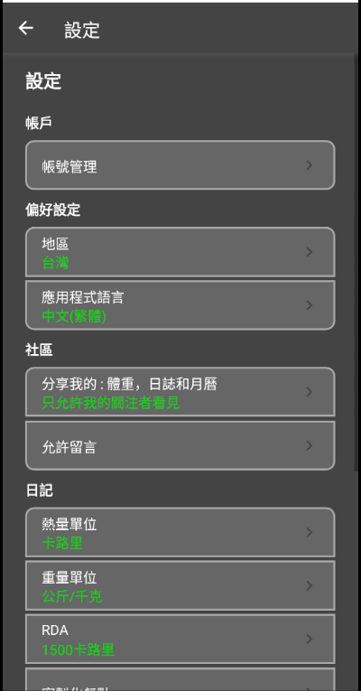
    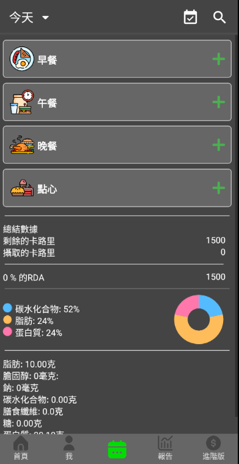
    
    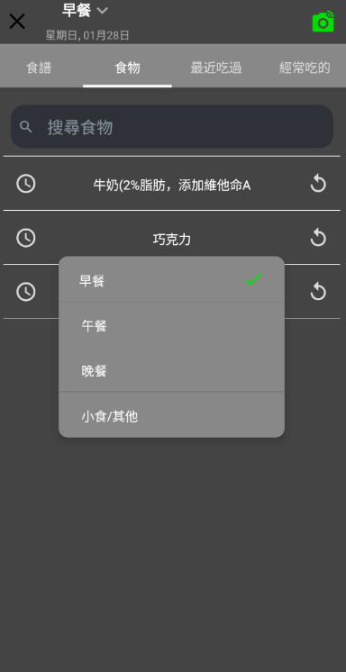
</div>
<div style="display:flex; flex-wrap: wrap;">
    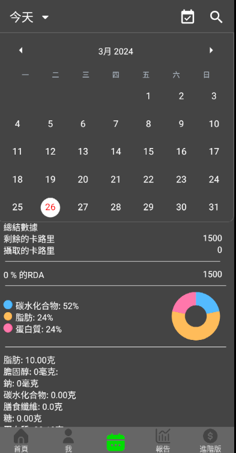
    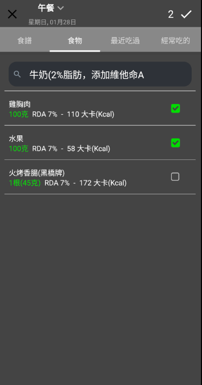
    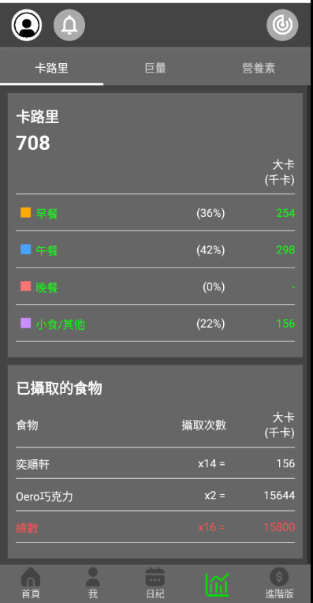
    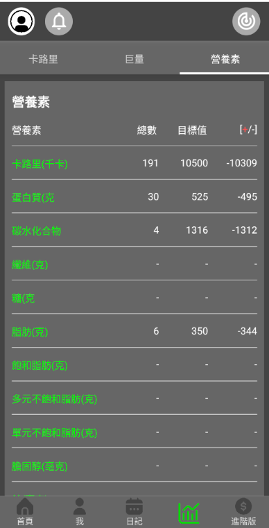
</div>
<div style="display:flex; flex-wrap: wrap;">
    
    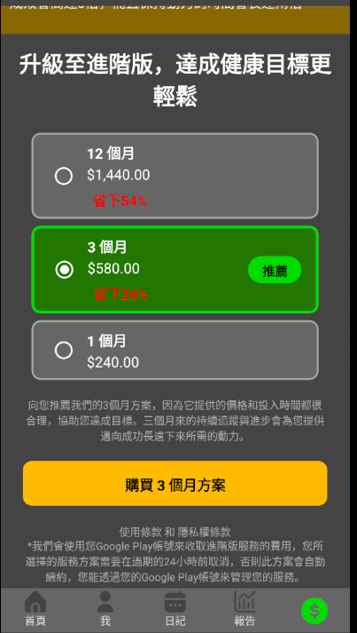
</div>
